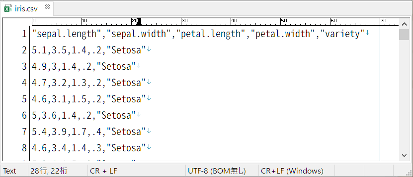

# Pythonを使ったファイルの読み書き

次にファイルの読み書きについて学びます．

--- 
### 読み書きの基本

データ分析の際には，データファイルからデータを読み出してプログラムで処理し，処理結果をデータファイルに保存します．ここでは，ファイルの読み書きについて学びます．

データの性質によってファイル保存形式が異なります．
下に代表的なデータと保存形式をまとめます．

| データの種類  | 主な保存形式 | 拡張子 |
| ------------- | ------------- | -------------  |
| テキスト・数値  | テキスト / `CSV形式` / TSV形式 / Wordファイル/ Excelファイル  | .txt / `.csv` / .tsv / .doc, .docx / .xlsx |
| 画像 | ビットマップ形式 / png形式 / jpeg形式 / gif形式  | .bmp / .png / .jpg, .jpeg / .gif |
| 映像  | avi形式 / mpeg4形式 / mov形式 / wmv形式  | .avi / .mp4 / .mov / .wmv |
| 音声  | wave形式 / mpeg形式 / aac形式  | .wav / .mp3 / .mp4, .aac |

今回は CSVファイルの読み書きを行います．他の形式のファイルの読み書きについては自身で調べてみましょう．

---
### csvファイルとは？

次のCSVファイルをWebブラウザで開きましょう．

[>> `iris.csv`](https://raw.githubusercontent.com/YosukeSugiura/Introduction_to_Programming/main/06_read_write/iris.csv)

Webブラウザで開いて，`右クリック → 名前をつけて保存` から好きなフォルダに保存しましょう．保存した `iris.csv` をメモ帳等のテキストエディタで眺めてみます．



[`iris.csv`](https://raw.githubusercontent.com/YosukeSugiura/Introduction_to_Programming/main/06_read_write/iris.csv) の見方を簡単に説明します．
- このファイルにはアヤメに関するデータが入っています．
- 行の中で `,` がデータの区切りです．１行あたり，5つの要素が並んでいることがわかります．
- １行目に各列の説明があります．これを「ヘッダー」と呼びます．データによっては１行目に各列の説明がない，つまりヘッダーがないものもあります．
- 各列の意味を日本語で書いておきます．  
 - sepal.lengh : がく片の長さ [cm]
 - sepal.width : がく片の幅 [cm]
 - petal.length : 花弁の長さ [cm]
 - petal.width : 花弁の幅 [cm]
 - variety : 種 (Setosa，Versicolor，Virginicaの３種類のいずれか)

このファイルには50行のデータが入っています．３種のアヤメの花を各50個体調べて，がく片の長さと幅・花弁の長さと幅を表形式に記録したものとなっています．

この世の多くの数値データは表形式で保存されています．表形式のデータは人にとって見やすく理解しやすいものですし，コンピュータにとっても検索や新たな行・列の追加などのデータ操作もしやすいものになっています．

---
### csvファイルの読み込み

読み込みの際には，次のコードをコピー&ペーストして使いましょう．その際，ファイルの中身を一度見てみて，ヘッダーがあるかどうかを確認してください．
- ヘッダーがある場合

```Python
# ヘッダーあり
import pandas as pd
import numpy as np
 
input_file = 'input.csv'	# 読み込むファイル名
input_data = pd.read_csv(input_file)
input_data = np.array(input_data)
```
- ヘッダーがない場合

```Python
# ヘッダーなし
import pandas as pd
import numpy as np
　
input_file = 'input.csv'	# 読み込むファイル名
input_data = pd.read_csv(input_file, header=None)
input_data = np.array(input_data)
```
変数 `input_file` に読み込みたいファイルの名前を入れましょう．  
読み込んだデータは `input_data` に入ります．

---
### csvファイルの書き込み

書き込みの際には，以下のコードを使いましょう．
```Python
output_file = 'output.csv'		# 書き込むファイル名
df = pd.DataFrame(data)
df.to_csv(output_file, header=False, index=False)
```

変数 `output_file_name` には書き込むファイルの名前が入ります．  
書き込むデータは `data` に入っているとします．

---
### 列と行の取り出し

読み込んだ表形式のデータは **２次元配列** (行列の形式) として扱われます．
(２次元リストではなく，２次元"配列" です．細かい説明は割愛しますが，リストと配列で異なりますので注意です．)

２次元配列を扱う際，特定の列・行の値を取り出したい場合があります．そんなときは以下のコマンドを使用します．

##### ２次元配列の値の取り出し

下のように，配列の `[ ]`の中に `(取り出したい行番号), (取り出したい列番号)` を書きます．番号の代わりに `:` を指定すると，すべての要素を取り出せます．

```Python
# 値の取り出し：２行目・1列目を取り出す．(０行目から数え始めることに注意)
value = input_data[2,1]

# 行の取り出し：0行目にあるすべての列の要素を取り出す．( : は全てという意味)
row_values = input_data[0,:]

# 列の取り出し：3列目にあるすべての行の要素を取り出す．( : は全てという意味)
column_values = input_data[:,3]
```

##### ２次元配列の範囲の値の取り出し

例えば「配列 `input_data` の２～５行目のデータのみを取り出したい」など，特定の範囲のデータを取り出したい場合があります．その場合，`input_data[:,2:5]` で特定の範囲の値を取り出せます．

```Python
# 行の範囲の指定：３行目から１０行目を取り出す．
row_values = input_data[3:10,:]

# 列の範囲の指定：はじめから２列目を取り出す．
column_values = input_data[0:2,]

# 行・列の範囲の指定：３行目から１０行目，０列目から２列目の範囲の値を取り出す．
extact_values = input_data[3:10,0:2]
```

---
## 練習問題
### 練習課題１： ファイルの読み込み

コード [`06_read_write_csv.py`](06_read_write_csv.py) を実行しましょう．

実行前に，まずは保存した [`iris.csv`](iris.csv) を Colaboratory のワークスペースに置きます．(自身のPCにファイルを保存するにはブラウザの `右クリック → 名前をつけて保存` からできます．)

##### Colaboratory のワークスペースへのデータの設置
1. Colaboratory 画面左の 「フォルダアイコン」 をクリックする．
2. 出てくるファイルウィンドウに [`iris.csv`](iris.csv) をドラッグ&ドロップで設置する．

実行すると，データの中身を見ることができます．

### 練習問題２： 列の取り出し

コード [`06_read_write_csv.py`](06_read_write_csv.py) を修正して，[`iris.csv`](iris.csv) の「variety」に対応する列の値のみを表示させましょう．どのような種があるでしょうか？

---
## 演習課題
### 演習課題１： 特定の文字列に一致する行の取り出し

コード [`06_read_write_2Darray.py`](06_read_write_csv.py) は「variety」に対応する列以外の列の値を全て取り出し，新たな配列 `output_data` に入れています．実行して確認しましょう．

このコードを修正し，「variety」が `Setosa` となる行の，がく片の長さと幅をすべて取り出しましょう.
さらに，その取り出したデータを `output.csv` ファイルに保存しましょう．

> ヒント： 繰り返し処理で学んだように， `if` 文を使って「variety」の列の値が `Setosa` の行のみを取り出します．

--- 
[< 前へ](../05_for) | [トップに戻る](https://github.com/YosukeSugiura/Introduction_to_Programming) | [次へ >](../07)
