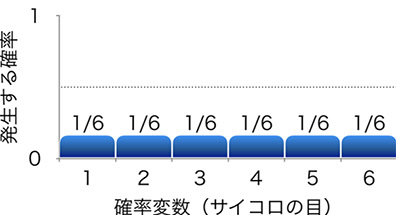
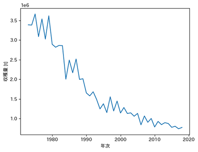

# 統計と線形回帰

統計の知識を応用すると，データに潜んだ特徴もわかるようになります．
ここでは基本的な統計的な知識と，それを応用した線形回帰について扱っていきます．

--- 
### 統計の基本

さて，[前章のヒストグラム](../08_prob_plot)を見て，点数の分布が山なり形状になっているように感じます．
統計では，テストを受けた人数 N が十分に大きいと，分布が山なりの **正規分布** に近づくことが知られています．
これはテストの点数だけではなく，自然界の様々な「事象」が正規分布に近づくことが知られています．
例えば学校の全生徒の身長をまとめたデータや映画のレビューの点数なども山なりの正規分布に近づくことが知られています．不思議ですよね．

統計の知識を身につけると，データに潜んだ分布の形を見極めたりすることができます．
それでは統計について勉強しましょう．

---
### 統計の基礎用語

統計に関するいくつかの用語をまとめます．

#### 確率変数

「確率変数」は、ある変数の値が現れる確率が存在する変数のことです．
例えば，「サイコロを振った時の出目」は確率変数です．
サイコロの出目をXとすると，Xの出る確率を次の表にまとめます．

| 出目 X  | 1 | 2 | 3 | 4 | 5 | 6 |
| --- | --- | --- | --- | --- | --- | --- | 
| 確率  | 1/6 | 1/6 | 1/6 | 1/6 | 1/6 | 1/6 |

１～６のそれぞれの目が出る確率は 1/6 ですよね．
サイコロの目は，出る値とそれに対応した確率がありますので，確率変数といえます．

例えば「身長測定したときに X cmになる確率」も，確率変数と考えることができます．
日本全国の男子の身長について，1cm以下を四捨五入して，それぞれの身長の値をとる割合を計算します．
これを「ある身長の値をとる確率」とみなせば，以下のような表を作ることができます．

| 身長 X  | ...| 160 | 161 | ... | 170 | 171 | ... | 190 | 191 | ... |
| --- | --- | --- | --- | --- | --- | --- | --- | --- | --- | --- | 
| 確率  | ... |  0.01 | 0.012 | ... | 0.25 | 0.24 | ... | 0.012 | 0.01 | ... |

身長が170cmの人は比較的多く，そこから離れるにつれて割合=確率が低くなります．
例えば160cmや190cmの人はまれになるわけです．

ここで，確率変数の確率は **すべて足すと必ず１になる** ことを覚えておきましょう．
サイコロの例がわかりやすいです．表にある確率をすべて足すと１になりますね．

#### 確率分布

上記のように，確率変数のそれぞれの値と確率の対応表を「確率分布」と呼びます．
サイコロの確率分布をグラフであらわすと次のようになります．



すべての出目が一律な確率で出ます．このときの分布を「一様分布」と呼びます．

次に男子の身長の確率分布をグラフで見てみます．


170cmで左右対称な山なり分布となりました．これを「正規分布」と呼びます．
正規分布は「平均」と「分散」によって形がひとつに定まります．
今回でいうと，「男子の身長は平均170cm，分散5cmの正規分布に従う」といった言い方ができます．

#### 最尤値

最も大きな確率をとる確率変数の値を最尤値と呼びます．
男子の身長においては，最尤値は「170cm」となります．

最尤値は「最頻値」とよく似ていますが，少し異なります．
これは次の大数の法則で説明します．


---
### 大数の法則

さて，「サイコロの出目は１～６それぞれ1/6の確率で出る」のは本当でしょうか？
じゃあ，「6回サイコロを振って，それぞれの出目が必ず１回ずつ出る」のでしょうか？
もちろん，そうはなりません．100回，1000回，あるいはもっとサイコロを振って，たくさん試行回数を重ねてようやく，「１～６の出目それぞれが1/6の確率で出る」という結果を得ることができます．

このように，少ない試行回数(= **標本** )では真の確率分布が得られませんが，十分に多い標本を集めれば真の確率分布がわかることを **大数の法則** と呼びます．

少ない標本ではヒストグラムと確率分布の形状一致しませんが，回数をかさねると一致するようになります．
最頻値はヒストグラムと関係しるので，標本数が少ないときは最頻値と最尤値は一致しないことが多いですが，標本数が増えてくると最頻値と最尤値はほぼ一致します．最頻値は標本数に大きく関係しますが，最尤値は標本数に関係しません．

---
### 中心極限定理

自然界の多くの事象で，十分の数の標本が得られたとき，その確率分布はおおよそ正規分布になることが知られています．
これを **中心極限定理** と呼びます．

もちろん，「サイコロの出目」はどれだけ試行を重ねても一様分布になりますし，中心極限定理に適さない確率変数もあります．
しかし，テストの点数や身長，商品レビューのスコアなど，多くの事象でこの定理が適用でき，確率分布が正規分布に近づきます．

中心極限定理は「定理」ですので数学的に証明が可能です．興味があれば調べてみてください．

---
### 最尤推定

さて確率変数の分布がわかったところで何が嬉しいのでしょうか？
それでは，さきほどのテストの点数の確率分布を見てみます．

ここで確率分布は正規分布です．
最もよく取られる点数を考えたとき，多くの場合 **「最頻値」より「最尤値」の方が優秀** です．
なぜなら，大数の法則によると，人数が少ない場合に最頻値と「真に最もよく取られる点数」が一致しないからです．

しかし最尤値を求めることも簡単ではありません．
テストの点数が正規分布に従うことがわかっていても，その平均と分散がわからないので，
正確な分布の形がわからず，最尤値を求めることができません．

そこで，「**最尤推定**」というテクニックを使うと最頻値がわかります．
最尤推定は，

- 分布の形状がわかっている(正規分布など)．
- 分布のパラメータがわからない(平均，分散など)．

のときに，その未知のパラメータを求める方法です．

ちなみに，確率分布が正規分布に従うとき，実は最尤値は平均と一致します．
なので小難しいことを考えず，今回の場合では
「このテストで最も取られる点数は，データの平均点の〇〇点である」と言うことができます．

---
### 回帰分析

この最尤推定は **回帰分析** に応用できます．
(最尤推定を知らなくても，回帰分析を使いこなすことは容易です．)

データ [fruits.csv](fruits.csv) を見てください．
０から数えて１列目に年ごとのみかんの収穫量のデータがあります．
プロットしてみると次のようになります．
このグラフからわかるように，みかんの収穫量は年々減少傾向にあります．



では１年後，あるいは１０年後にみかんの収穫量はどうなっているか，**予測** してみましょう．
多くの人は，次のグラフのように，なんとなく曲線を引いてみて，これに沿って数値を予測するのではないでしょうか？
「回帰分析」を使えば，この曲線を(数学的な意味で)より正確に引くことができます．

回帰分析は，

- ある程度データが従う関数形状がわかっている(2次曲線)．
- その関数を示すパラメータがわからない．

ときに，関数のパラメータを求めることができます．
もっとざっくばらんに言うと，「データに尤(もっと)も当てはまる関数(=曲線や直線)を引く」ことをしてくれます．

...回帰分析と最尤推定，できることが似ていますよね？回帰分析の背景には最尤推定が絡んできますが，ここでは割愛します．

#### 線形回帰の書き方

コード [`linear_regression.py`](09_linear_regression.py) はみかんの収穫量に対して直線を当てはめて回帰分析を適用した結果です．
直線を当てはめる回帰分析のことを **線形回帰** と呼びます．
最近では **直線フィッティング** などと呼ばれることもあります．
また回帰分析において，当てはめた関数(今回は直線)のことを **モデル** と呼びます．特に線形回帰では使用するモデルを「線形モデル」と呼びます．

線形回帰においては，まず３８～４０行目のように入力を定めます．
```Python
# 年次を入力としてみかんの収穫量を予測する．
polynomial_features= PolynomialFeatures(degree=1) # 1次関数(直線)を使用
input_ploy = polynomial_features.fit_transform(years) # 入力を定める
```

関数 `PolynomialFeatures()` でモデルの形を選択します．`degree=1` の場合，一次関数(直線)となります．
次に，メソッド `.fit_transform()` でモデルに入力できる形を定めます．この行はおまじないと考えましょう．

そして入力データを使って線形モデルを当てはめます．
```Python
# 線形モデルを当てはめる
model = LinearRegression()  # 回帰分析の準備
model.fit(input_ploy, mikan)    # 回帰分析の実施
mikan_pred = model.predict(input_ploy)# 回帰分析の結果を出力
```

まずは `LinearRegression()` でモデルを作成して，メソッド '.fit()' でパラメータ(どのような傾き・切片の直線か？)を求めます．
そしてメソッド '.predict()' で結果を得ます．

次に回帰分析した結果を出力します．
```Python
# グラフにプロットする
plt.plot(years, mikan)  # 実データ
plt.plot(years, mikan_pred) # 回帰結果
plt.xlabel('年次')
plt.ylabel('収穫量 [t]')
```


ちなみに，作成したモデルがどれだけデータにマッチしているかを 
**R2スコア** から測ることができます．
R2スコアは，モデルがデータにマッチしているほど `1` に近づき，
データから離れると '0' に近づきます．
```Python
# グラフにプロットする
# R2スコア
r2 = r2_score(mikan, mikan_pred)
print('R2 Score : {0:.2}'.format(r2))
```
R2スコアの結果は以下のようになります．

> R2 Score : 0.88

比較的高い値を出しています．
なのでこのモデルはデータにある程度マッチしていることがわかります．

#### 線形回帰による予測

さて線形回帰を実現できたら，次に **予測** を行いましょう．
データには2023年，2030年のみかんの収穫量は含まれていません．
線形回帰で推定した直線を利用すると，2023年，2030年のみかんの収穫量を予測できます．

まずは推定したい年次を入れた配列を設定します．
```Python
# 2023年，2030年の予測
years_future = np.array([2023,2030]) # 予測したい年のデータ
years_future = years_future[:,np.newaxis] # おまじない
```

次に `polynomial_features.fit_transform` でモデルに入力できる形を定めて，
モデルに入力します．
```Python
input_ploy = polynomial_features.fit_transform(years_future) # 入力を定める
mikan_future = model.predict(input_ploy) # 予測の結果
```

最後に予測値を出力してみましょう．
```Python
print(' 2023年のみかんの収穫量：{0:.0f} t'.format(mikan_future[0,0]))
print(' 2030年のみかんの収穫量：{0:.0f} t'.format(mikan_future[1,0]))
```
結果は以下のとおりです．

> 2023年のみかんの収穫量：-35862 t  
> 2030年のみかんの収穫量：-492421 t  

収穫量が負の値になってしまいました．
これは妥当な予測ができているとは言えません．

#### 多項式回帰の書き方

データに当てはめるモデルは直線だけではありません．
２次関数や３次関数など， 曲線を使った回帰を **多項式回帰** と呼びます．
あるいは **多項式フィッティング** と呼ぶ場合もあります．
特に多項式回帰で使用するモデルは「多項式モデル」と呼びます．

多項式回帰は，
```Python
# 年次を入力としてみかんの収穫量を予測する．
polynomial_features= PolynomialFeatures(degree=1) # 1次関数(直線)を使用
input_ploy = polynomial_features.fit_transform(years) # 入力を定める
```

関数 `PolynomialFeatures()` でモデルの形を選択します．
２次関数を用いる場合，`degree=2` とします．
３次関数を用いる場合，`degree=3` とします．
```Python
# 年次を入力としてみかんの収穫量を予測する．
polynomial_features= PolynomialFeatures(degree=2) # 2次関数を使用
input_ploy = polynomial_features.fit_transform(years) # 入力を定める
```

他のコードの部分は線形回帰と同じで実行しましょう．


R2スコアは以下のとおりです．

> R2 Score : 0.95

線形回帰のときよりもR2スコアは上昇し，多項式モデルがよりデータにマッチしていることがわかります．
また2023年，2030年の収穫量の予測結果は以下のとおりです．

> 2023年のみかんの収穫量：905741 t  
> 2030年のみかんの収穫量：1153762 t

予測した収穫量は正の値となり，線形予測より妥当な数値が出たことが確認できました．
しかし，2030年の収穫量は2023年より増加しており，モデルが最適であるかについては疑問が残ります．

---
### 回帰分析における過学習

上で見たように，一般的にモデルは直線より曲線の方がデータにマッチしやすい傾向にあります．
もっと言うと，モデルとする曲線の次数が増加するたびに，曲線の形は複雑にでき，よりデータにマッチします．

> 補足：  
> N次関数は極を N-1 個まで持つことができます．  
> わかりやすく言うと，２次関数ならカーブが１つ，３次関数ならカーブが２つ，...といったように，次数とカーブの数が比例します．

しかし，次数を増やし過ぎると曲線があまりにデータにマッチしすぎて，未知の値を予測するときにかえって誤差が大きくなる場合があります．
これを **過適合** あるいは **過学習** と呼びます．
なので「R2スコアが高いから，良いモデルだ！」と安易に判断せず，データの特徴を観察しつつ，良いモデルかどうかを判断してください．

---
## 練習問題
### 練習問題 16：線形回帰と多項式回帰

コード [`09_linear_regression.py`](09_linear_regression.py) を実行し，線形回帰を適用したときのみかん収穫量の予測結果を確認せよ．
またコード [`09_polynomial_regression.py`](09_polynomial_regression.py)を実行し，多項式回帰を適用したときのみかん収穫量の予測結果を確認せよ．

データは次のURLからダウンロードしてください．  
[>> `fruits.csv`](https://raw.githubusercontent.com/YosukeSugiura/Introduction_to_Programming/main/09_statistics/fruits.csv)

### 練習問題 17：多項式回帰の次数と過学習

コード [`09_polynomial_regression.py`](09_polynomial_regression.py)の多項式次数(degree)を増加させたときに，
R2スコアがどう変化するか，そして2023年，2030年の収穫量の予測結果がどう変化するかを確認せよ．

---
## 演習課題
### 演習課題 6：様々な回帰モデル

コード [`09_polynomial_regression2.py`](09_polynomial_regression2.py)を見てみましょう．
このコードは1946年～2020年の消費者物価指数のデータ([`bukka.csv`](https://raw.githubusercontent.com/YosukeSugiura/Introduction_to_Programming/main/09_statistics/bukka.csv))に対して多項式回帰を適用したものです．下に，年次ごとに消費者物価指数をプロットしたものを示します．


データは次のURLからダウンロードしてください．  
[>> `bukka.csv`](https://raw.githubusercontent.com/YosukeSugiura/Introduction_to_Programming/main/09_statistics/bukka.csv)  
このデータには，0列目に年次が，1列目に消費者物価指数が入っています．

コードを修正し，多項式次数(degree)を変更したり，様々なモデルを利用して回帰を行ってみましょう．
R2スコアや2023年，2030年の予測消費者物価指数はどのように変化するでしょうか？
下に，回帰モデルの例を示します．自身で調べてみて，活用してみましょう．

- 線形回帰
- 多項式回帰
- リッジ回帰 (`sklearn.linear_model.Ridge()`)
- ラッソ回帰 (`sklearn.linear_model.Lasso()`)

> [`bukka.csv`](https://raw.githubusercontent.com/YosukeSugiura/Introduction_to_Programming/main/09_statistics/bukka.csv)は「[持家の帰属家賃を除く総合指数（1947年～最新年）](https://www.e-stat.go.jp/stat-search/files?tclass=000001138366)」（総務省）を加工して作成


---
[< 前へ](../08_prob_plot) | [トップに戻る](https://github.com/YosukeSugiura/Introduction_to_Programming) | 
